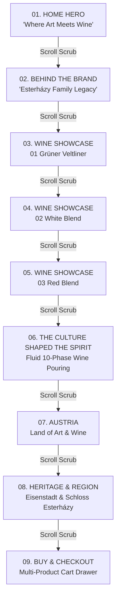

# 🍷 KLIMT WINE — Where Art Meets Wine

[](https://vitejs.dev/)
[](https://reactjs.org/)
[](https://www.typescriptlang.org/)
[](https://threejs.org/)
[](https://greensock.com/gsap/)
[](https://vercel.com/)

A **cinematic, scroll-driven editorial WebGL experience** inspired by the official **[KLIMT WINE](https://klimtwine.com/en)** brand. 

This application merges **high-fashion editorial typography**, **4K transparent 3D WebGL bottle rendering**, **60fps Lenis kinetic inertial scrolling**, and **frame-by-frame GSAP ScrollTrigger timeline choreography**.

---

## 🎬 Master Scroll Timeline Architecture

The website functions as a continuous, interactive visual timeline bound directly to the user's scroll position:



---

## ✨ Features & Visual Highlights

### 1. 🏰 Home Hero ("Where Art Meets Wine")
- **Editorial Canela Serif Headline**: Ultra-large typography (`fontSize: clamp(5rem, 9vw, 9.8rem)`) with soft ambient drop shadows.
- **Physical 3D WebGL Bottle**: Real-time Three.js canvas featuring specular glass refractions, realistic lighting, and official 4K Gustav Klimt label artwork.
- **Organic Branch Sculpture**: High-resolution vine log branch (`cta_branch_v2.webp`) looping behind the bottle in an S-curve.
- **Header Navigation**: Stacked vertical menu (`Heritage`, `Region`, `Contacts`), centered white crest logo (`ESTERHÁZY AUSTRIA`), language toggle (`EN / FR`), and CTA controls.

### 2. 📖 Behind the Brand
- **Seamless Atmosphere Shift**: Background smoothly transforms from dark hero video to warm cream canvas (`#ECE9E5`).
- **Continuous 3D Bottle Float**: The bottle tilts diagonally (`22°`) and rotates to reveal its back label patterns, floating directly over the brand story text paragraph.

### 3. 🍾 Showcase Collection
- **01 Grüner Veltliner** *(Crisp Green-Gold Spotlight)*: Notes of citrus blossom, yellow apple, white pepper, limestone.
- **02 White Blend** *(Shimmering Golden Spotlight)*: Notes of honeyed apricot, white peach, elderflower, golden slate.
- **03 Red Blend** *(Deep Velvety Burgundy Spotlight)*: Notes of dark cherry, roasted plum, black cocoa, velvet oak.
- **Interactive Modals**: Structured tabular technical sheets (Vintage, ABV %, Soil, Acid, Sugar, Serving Temp) and sommelier food pairing recommendations.

### 4. 🍷 The Culture Shaped the Spirit (Photorealistic Pouring Animation)
- **10-Phase GSAP Scroll Choreography**:
  - Bottle tilts horizontal and aligns its top mouth opening over a transparent crystal wine glass.
  - **Fluid Liquid Stream**: Gravity-tapered SVG liquid path with specular highlights and falling liquid droplets.
  - **Pour Impact Ripples & Meniscus**: Concentric surface ripples and rising liquid fill inside the glass bowl.
  - **Text Transformation**: `"The culture shaped the spirit"` transitions to `"Together, they shaped KLIMT"`.
  - **Editorial Reveal**: Transitions into `"Austria: Land of Art and Wine"` with outdoor dining photography.

### 5. 🛒 Heritage, Region & Luxury Checkout Drawer
- **Burgenland Region Map**: Interactive contour map highlighting Eisenstadt coordinates.
- **Multi-Product Cart Drawer**: Select quantities for Grüner Veltliner, White Blend, and Red Blend with subtotal calculation, free shipping progress, and instant order confirmation.

---

## 🛠️ Tech Stack & Libraries

- **Frontend Core**: React 18, Vite 8, TypeScript
- **3D WebGL Rendering**: Three.js, `@react-three/fiber`, `@react-three/drei`
- **Animation & Physics**: GSAP 3 (ScrollTrigger), Lenis Inertial Smooth Scroll
- **Icons**: Lucide React
- **Styling**: Vanilla CSS3 Custom Tokens, Glassmorphism, HSL Color Palettes

---

## 🚀 Local Installation & Setup

1. **Clone the repository**:
   ```bash
   git clone https://github.com/vanishajalady/klintwine.git
   cd klintwine
   ```

2. **Install dependencies**:
   ```bash
   npm install
   ```

3. **Start local development server**:
   ```bash
   npm run dev
   ```
   Open `http://localhost:5173/` in your browser.

4. **Build production bundle**:
   ```bash
   npm run build
   ```

---

## 🌐 Deploying to Vercel

This project is fully configured for zero-config deployment on **[Vercel](https://vercel.com/)**:

### Option 1: Via Vercel CLI
```bash
npm i -g vercel
vercel
```

### Option 2: Via Vercel Dashboard
1. Go to [vercel.com/new](https://vercel.com/new).
2. Connect your GitHub account and select `vanishajalady/klintwine`.
3. Keep default settings:
   - **Framework Preset**: Vite
   - **Build Command**: `npm run build`
   - **Output Directory**: `dist`
4. Click **Deploy**.

---

## 📜 License

Created for educational and artistic demonstration purposes inspired by [KLIMT WINE](https://klimtwine.com/en).
